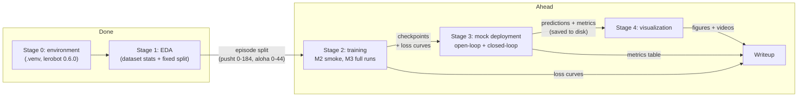

# Stage Three Notes — The Pipeline

How the remaining stages of the project will be implemented, how they flow together,
what can go wrong in each, what additional context is needed, and which papers inform
each part. Companion to [NOTES.md](NOTES.md) (Stage One: policies + behavior cloning;
Stage Two: the task, ACT vs Diffusion, dataset choice) and [DESIGN.md](DESIGN.md).

---

## The pipeline as a whole — how the stages connect

Each stage exists to produce an artifact the next stage consumes. Nothing downstream
starts from scratch.

Two scheduling consequences:

1. The **M2 smoke checkpoint** is a test fixture: all of Stage 3's code can be built and
   debugged against it while the full M3 training runs elsewhere. Training compute and
   evaluation tooling proceed in parallel.
2. Stage 3 must **save its raw predictions to disk** (predictions, ground truth, metrics)
   so Stage 4 can iterate on plots freely without re-running inference.

---

## Stage 2 — Training (M2 smoke, M3 full runs)

### What `lerobot-train` actually assembles

- A **dataloader** over our train episodes that uses *delta timestamps* to serve each
  observation together with the next N expert actions — this is how chunks/horizons are
  formed from flat episode data.
- **Per-feature normalization statistics** computed from the dataset (images, state,
  actions all normalized; the policy carries these stats inside its checkpoint).
- The **policy module** (ACT or diffusion) with the paper's hyperparameters as defaults.
- A **training loop** that logs loss and saves resumable checkpoints.

Hyperparameters that matter most:

- ACT: `chunk_size` (~100 frames = 2 s of motion at ALOHA's 50 fps — fps determines the
  time horizon of a chunk) and `kl_weight` (CVAE regularization).
- Diffusion: action horizon (~16), number of denoising steps, noise schedule.

### Process

1. **M2 smoke test** (local, MPS): 2,000 diffusion steps on PushT. Proves data loading,
   loss computation, and checkpointing end to end; surfaces the known MPS float64 quirk
   early. Loss should visibly decrease; the policy will still be bad — fine. Its
   checkpoint becomes the fixture for building Stage 3.
2. **M3 full runs** (100k steps each) on whichever compute lands first:
   Georgia Tech PACE / AI Makerspace → HF Jobs (`--job.target=...`, pay-as-you-go,
   pushes checkpoint to the Hub) → overnight reduced-step MPS as last resort.

### What to watch / failure modes

- ACT's loss has two parts (L1 + KL). If KL collapses to ~0, the CVAE latent is being
  ignored.
- Diffusion's denoising MSE falls fast then plateaus — normal.
- The classic silent failure in BC is a **normalization bug**: outputs look reasonable in
  normalized space, insane in robot space. Stage 3's replay catches this immediately —
  another reason to build it against the smoke checkpoint.

### Context needed / user can provide

- Georgia Tech PACE / AI Makerspace access confirmation (the open action item).
- HF token (needed for HF Jobs and for pushing checkpoints to the Hub).
- Optional: WandB account for nicer loss curves in the report.

### Papers

- ACT / ALOHA: Zhao et al., RSS 2023 — arXiv:2304.13705.
- Diffusion Policy: Chi et al., RSS 2023 — arXiv:2303.04137.
- robomimic, "What Matters in Learning from Offline Human Demonstrations" —
  arXiv:2108.03298. *The* reference on BC training/eval practice; notably: select
  checkpoints by rollout success, not loss — best-loss and best-policy checkpoints
  often differ.

---

## Stage 3 — Mock deployment (M4, the core deliverable)

Two evaluations, deliberately different in kind.

### (a) Open-loop replay — `scripts/03_mock_deploy.py` (the main thing we write)

For each held-out episode (pusht 185–205, aloha 45–49): load the checkpoint, step
through the episode's observations, and at each timestep ask the policy what it *would*
do — recording the **full predicted chunk/horizon**, not just the next action. Ground
truth (what the human actually did) is in the episode, so we get:

- per-step action MSE,
- end-effector error **as a function of prediction depth** (expect error to grow with
  how far ahead the policy predicts).

Implementation notes:

- v0.6.0 added **batch inference** for ACT and Diffusion → process whole episodes at once.
- The policy's built-in pre/post-processors handle normalization (getting this wrong is
  the classic bug — never normalize manually).
- For diffusion, sample **multiple predictions per state** with different noise seeds —
  the multimodality money shot for Stage 4.
- Save everything to disk (predictions, ground truth, metrics) for Stage 4.

### (b) Closed-loop rollout — mostly free via `lerobot-eval`

The policy actually drives `gym-pusht` / `gym-aloha` for ~50 episodes; collect success
rate, rewards, rollout videos. This is true deployment: the policy lives with the
consequences of its own actions (its actions determine its next observations).

### Why both

Open-loop error and closed-loop success measure different things, and the literature
shows they can rank policies **differently** — covariate shift compounds small errors.
Where our two numbers disagree is a *finding*, not a bug; it goes in the report.

### Papers

- DAgger: Ross et al., 2011 — arXiv:1011.0686. The original formalization of why cloned
  policies drift (compounding errors / covariate shift).
- "Tune to Learn" — arXiv:2604.02523. Higher validation MSE yet better closed-loop
  policy; the citation behind DESIGN.md's evaluation framing.
- Implicit Behavioral Cloning: Florence et al., 2021 — arXiv:2109.00137. Introduced the
  PushT task; useful for its multimodality discussion.

---

## Stage 4 — Visualization (M5)

### PushT (2D) — easy, high payoff

The action *is* the 2D end-effector target, so predictions plot directly onto the 96×96
workspace: ground-truth path in one color, predicted horizons fanning out ahead of each
state in another. With multiple diffusion samples per state, multimodal states show as
**forking fans** — the single most legible illustration of why diffusion exists.

### ALOHA (3D) — baseline plus stretch

- Guaranteed baseline: per-joint predicted-vs-truth trajectory plots (14 small panels).
- Stretch: real forward kinematics **via MuJoCo** — `gym-aloha` ships the ALOHA MuJoCo
  model, and MuJoCo computes FK for us (set the 14 joint angles, read the gripper site's
  3D position). No URDF parsing needed.
- The 3D end-effector traces go into a **Viser** scene: ground-truth trace as a line,
  predicted chunks as short colored segments branching off it, with a timestep slider.
  This is the interactive demo artifact from DESIGN.md §8.

Also: static matplotlib versions of everything (the report cannot embed a Viser
session), and rollout videos from Stage 3(b) embedded alongside.

### Context needed / user can provide

- Nothing blocking. Optional: Task-1 Viser code for stylistic consistency.

---

## Writeup (M6)

Assembles what already exists by then:

- Loss curves (Stage 2), metrics table (Stage 3), figures/videos (Stage 4).
- The running **LeRobot issues log** — accumulating since M0. Current entries:
  1. v0.6.0 removed `LeRobotDataset.episode_data_index` without deprecation; episode
     boundaries moved to the `meta.episodes` Arrow table
     (`dataset_from_index` / `dataset_to_index`).
  2. PyAV's bundled ffmpeg dylibs clash with Homebrew ffmpeg on macOS (objc class
     duplication warnings).
- The one section requiring actual thought: the **open-loop vs closed-loop comparison** —
  where "understand what's happening" gets demonstrated.

### Context needed / user can provide

- Notes from the meeting with Irmak about what she emphasized — calibrates the report's
  tone and depth.
