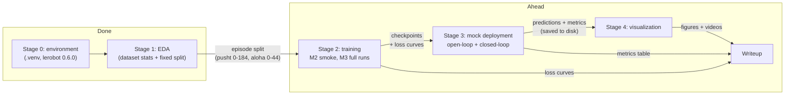

# Stage Three Notes — The Pipeline

How the remaining stages of the project will be implemented, how they flow together,
what can go wrong in each, what additional context is needed, and which papers inform
each part. Companion to [NOTES.md](NOTES.md) (Stage One: policies + behavior cloning;
Stage Two: the task, ACT vs Diffusion, dataset choice) and [DESIGN.md](DESIGN.md).

---

## The pipeline as a whole — how the stages connect

Each stage exists to produce an artifact the next stage consumes. Nothing downstream
starts from scratch.

```mermaid
flowchart LR
    subgraph done [Done]
        S0["Stage 0: environment\n(.venv, lerobot 0.6.0)"]
        S1["Stage 1: EDA\n(dataset stats + fixed split)"]
    end
    subgraph ahead [Ahead]
        S2["Stage 2: training\nM2 smoke, M3 full runs"]
        S3["Stage 3: mock deployment\nopen-loop + closed-loop"]
        S4["Stage 4: visualization"]
        S5["Writeup"]
    end
    S0 --> S1
    S1 -->|"episode split\n(pusht 0-184, aloha 0-44)"| S2
    S2 -->|"checkpoints\n+ loss curves"| S3
    S3 -->|"predictions + metrics\n(saved to disk)"| S4
    S4 -->|figures + videos| S5
    S3 -->|metrics table| S5
    S2 -->|loss curves| S5
```

Two scheduling consequences:

1. The **M2 smoke checkpoint** is a test fixture: all of Stage 3's code can be built and
   debugged against it while the full M3 training runs elsewhere. Training compute and
   evaluation tooling proceed in parallel.
2. Stage 3 must **save its raw predictions to disk** (predictions, ground truth, metrics)
   so Stage 4 can iterate on plots freely without re-running inference.

---

## Stage 2 — Training (M2 smoke, M3 full runs)

### What `lerobot-train` actually assembles

- A **dataloader** over our train episodes that uses *delta timestamps* to serve each
  observation together with the next N expert actions — this is how chunks/horizons are
  formed from flat episode data.
- **Per-feature normalization statistics** computed from the dataset (images, state,
  actions all normalized; the policy carries these stats inside its checkpoint).
- The **policy module** (ACT or diffusion) with the paper's hyperparameters as defaults.
- A **training loop** that logs loss and saves resumable checkpoints.

Hyperparameters that matter most:

- ACT: `chunk_size` (~100 frames = 2 s of motion at ALOHA's 50 fps — fps determines the
  time horizon of a chunk) and `kl_weight` (CVAE regularization).
- Diffusion: action horizon (~16), number of denoising steps, noise schedule.

### Process

1. **M2 smoke test** (local, MPS): 2,000 diffusion steps on PushT. Proves data loading,
   loss computation, and checkpointing end to end; surfaces the known MPS float64 quirk
   early. Loss should visibly decrease; the policy will still be bad — fine. Its
   checkpoint becomes the fixture for building Stage 3.
2. **M3 full runs** (100k steps each) on whichever compute lands first:
   Georgia Tech PACE / AI Makerspace → HF Jobs (`--job.target=...`, pay-as-you-go,
   pushes checkpoint to the Hub) → overnight reduced-step MPS as last resort.

### What to watch / failure modes

- ACT's loss has two parts (L1 + KL). If KL collapses to ~0, the CVAE latent is being
  ignored.
- Diffusion's denoising MSE falls fast then plateaus — normal.
- The classic silent failure in BC is a **normalization bug**: outputs look reasonable in
  normalized space, insane in robot space. Stage 3's replay catches this immediately —
  another reason to build it against the smoke checkpoint.

### Additional context

Record project requirements that affect the evaluation scope and reporting depth.
