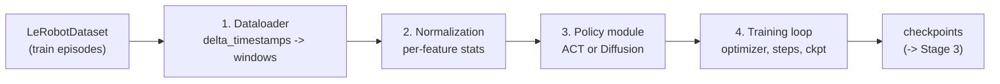

# Training Notes — End-to-End Training Decisions

A decision log for the training stage (Stage 2 of the pipeline in
[NOTES_PIPELINE.md](NOTES_PIPELINE.md)). `lerobot-train` assembles four things — a
**dataloader**, **per-feature normalization**, the **policy module**, and the **training
loop** — and each is a decision, not a given. This document goes component by component:
what it is, the options, LeRobot 0.6.0's default, and *our decision + why*.

All defaults below are ground truth read directly from the installed `lerobot==0.6.0`
(`ACTConfig`, `DiffusionConfig`, `TrainPipelineConfig`, `DatasetConfig`), cross-checked
against the official `lerobot/diffusion_pusht` model card and the ACT/Diffusion papers.

Principle we follow throughout: **start from the paper-matched LeRobot defaults** (they
are validated to reproduce published success rates), change something only when our
setup or goal demands it, and record every deviation.

---

## Component 1 — The dataloader (how flat episodes become training windows)

**What it is.** The policies do not consume single frames; they consume *windows*
(some observation steps + a horizon of future actions). LeRobot builds these from the
flat, episode-indexed dataset using **`delta_timestamps`** — per-key lists of relative
time offsets. The policy config declares what it needs via `observation_delta_indices`
and `action_delta_indices`, and the dataset serves each item with those neighbors
stacked. This is the mechanism that turns "predict a chunk" into concrete tensors.

- **ACT** (`n_obs_steps=1`, `chunk_size=100`): observation = current frame only;
  action window = `range(100)` → the next 100 actions. At ALOHA's 50 fps that is **2 s of
  motion per prediction**.
- **Diffusion** (`n_obs_steps=2`, `horizon=64`): observation = current + 1 previous
  frame; action window = 64 steps aligned to the observation window. At PushT's 10 fps
  that is **6.4 s of horizon**, of which 32 are executed (`n_action_steps=32`).

**Padding at episode edges.** Windows near the end of an episode run past its last frame;
LeRobot copy-pads and flags padded steps. Diffusion sets `drop_n_last_frames=7` to skip
the worst offenders (matches the original implementation and "leads to improved training
results"). Whether padded steps contribute to the loss is a separate normalization/loss
decision (see `do_mask_loss_for_padding` below).

**Knobs and defaults (`TrainPipelineConfig` / `DatasetConfig`):**

| Knob | Default | Meaning |
|------|---------|---------|
| `batch_size` | 8 | windows per gradient step |
| `num_workers` | 4 | dataloader processes |
| `prefetch_factor` | 4 | batches prefetched per worker |
| `return_uint8` | False | return RGB as uint8 (faster IPC) vs float32 |
| `video_backend` | auto | MP4 frame decoder |
| `streaming` | False | stream from Hub vs local cache |

### Decisions

- **Batch size.** Diffusion/PushT → **64** (the official card's value; the community
  rule is "raise batch before steps" because diffusion needs many noise samples per
  update — batch 64 sees 320k samples in 5k steps). ACT/ALOHA → **8** (VRAM-bound: 480×640
  images at batch 8 already need ~12 GB). On the **MPS smoke run**, drop diffusion to
  **32** (or 16) to fit and finish fast.
- **num_workers.** Keep **4** on the GPU box; on macOS MPS use **0–2** (fork/semaphore
  quirks). Watch the `data_s` field in logs — if it is large next to `updt_s`, the
  dataloader is the bottleneck and workers/`prefetch_factor` should go up.
- **return_uint8 = True** for full GPU runs (cheaper IPC; the trainer casts to float on
  device). Leave default for the smoke run.
- **Local cache, not streaming.** Both datasets are already downloaded; `streaming=False`
  is faster and avoids Hub rate-limit warnings.
- **Delta indices / chunking are left to each policy's config** — they are the policy's
  contract with the dataloader and should not be hand-edited.

---

## Component 2 — Per-feature normalization

**What it is.** Every feature is normalized before the network and de-normalized after,
using statistics computed from the training set. The *mode* is chosen **per feature type**
via `normalization_mapping`. Modes available in 0.6.0: `MEAN_STD`, `MIN_MAX`, `IDENTITY`,
`QUANTILES`, `QUANTILE10`. This is the single most common source of silent BC bugs, so the
choices matter.

**Defaults (ground truth):**

| Feature | ACT | Diffusion |
|---------|-----|-----------|
| VISUAL | MEAN_STD | MEAN_STD |
| STATE | MEAN_STD | **MIN_MAX** |
| ACTION | MEAN_STD | **MIN_MAX** |

Plus `DatasetConfig.use_imagenet_stats = True`: visual features are normalized with
**ImageNet** mean/std, not dataset stats — because both policies use an ImageNet-pretrained
ResNet-18 backbone that expects that input distribution.

### Decisions — keep each policy's default mapping, because the modes are coupled to the architectures

- **Diffusion uses MIN_MAX for state/action on purpose.** The denoiser has
  `clip_sample=True, clip_sample_range=1.0`, i.e. it clips samples to [-1, 1] every
  denoising step. That is only valid if actions were scaled into [-1, 1] — which is
  exactly what MIN_MAX does. MEAN_STD here would push values outside the clip range and
  corrupt sampling. **MIN_MAX and `clip_sample` are a matched pair; we keep both.**
- **ACT uses MEAN_STD everywhere.** No sample clipping in a CVAE, and joint-space actions
  are roughly Gaussian, so standardization is the natural fit. Keep it.
- **Visual = ImageNet stats (keep `use_imagenet_stats=True`).** The pretrained backbone
  expects it; recomputing from our small datasets would fight the pretrained weights.
- **Stats are computed on the train split only.** Because we pass `--dataset.episodes`
  (pusht 0–184, aloha 0–44), normalization stats never see the held-out episodes — no
  leakage into M4.

---

## Component 3 — The policy module

Same supervised loop for both; the architecture and loss differ. Below are the defaults
we inherit and the few knobs we consciously set.

### 3a — Diffusion Policy (PushT)

Ground-truth 0.6.0 defaults, with notes on where they diverge from the RSS-2023 paper:

| Group | Param | Default | Note / decision |
|-------|-------|---------|-----------------|
| Horizon | `horizon` / `n_action_steps` / `n_obs_steps` | 64 / 32 / 2 | 0.6.0 default (classic paper used 16 / 8 / 2). **Keep 64/32** — it is what the official 65%-success card uses. |
| Backbone | `vision_backbone` / weights | resnet18 / ImageNet | keep |
| Backbone | `use_group_norm` | **False** | classic DP used GroupNorm (BatchNorm stats are unreliable with EMA + receding horizon). 0.6.0 default is False and still reproduces 65%. **Keep False**, flag as a possible ablation. |
| Backbone | `crop_shape` | None (no crop) | classic DP random-cropped 96→84. Default now does no crop. **Keep no-crop** (matches the validated card); note as ablation. |
| Backbone | `use_separate_rgb_encoder_per_camera` | True | PushT has 1 camera, so moot; keep |
| U-Net | `down_dims` / `kernel_size` / `n_groups` | (512,1024,2048) / 5 / 8 | keep (`horizon` must stay a multiple of 2^len(down_dims)=8; 64 ✓) |
| Noise | `noise_scheduler_type` | DDPM | **train with DDPM** |
| Noise | `num_train_timesteps` | 100 | keep |
| Noise | `beta_schedule` | squaredcos_cap_v2 | the iDDPM cosine schedule the DP paper found best; keep |
| Noise | `prediction_type` | epsilon | predict noise (works better than `sample`); keep |
| Inference | `num_inference_steps` | None (=100) | **decision below** |
| Loss | `do_mask_loss_for_padding` | False | matches original DP; keep |
| Optim | lr / betas / wd | 1e-4 / (0.95,0.999) / 1e-6 | keep |
| Optim | scheduler | cosine, 500 warmup | keep |

**Inference-steps decision (matters for M4).** Train with DDPM-100. For evaluation, run
**DDPM-100 as the primary** (we are in sim, not real-time-constrained, so favor fidelity)
and additionally run **DDIM-10 as an ablation** — the DP paper shows DDIM with 10 inference
steps ≈ DDPM-100 quality at ~10× speed, and cheap sampling makes the multi-sample
multimodality visualization (Stage 4) practical. This is an inference-time switch; no
retraining needed.

### 3b — ACT (ALOHA)

| Group | Param | Default | Note / decision |
|-------|-------|---------|-----------------|
| Chunk | `chunk_size` / `n_action_steps` / `n_obs_steps` | 100 / 100 / 1 | keep (open-loop within a 100-step chunk = 2 s at 50 fps) |
| Backbone | resnet18 / ImageNet | | keep |
| Transformer | `dim_model` / `n_heads` / `dim_feedforward` | 512 / 8 / 3200 | keep |
| Transformer | `n_encoder_layers` / `n_decoder_layers` | 4 / **1** | decoder=1 deliberately matches an upstream ACT bug (only first layer was used); keep for parity |
| VAE | `use_vae` / `latent_dim` / `n_vae_encoder_layers` | True / 32 / 4 | keep (the CVAE is ACT's multimodality mechanism) |
| Loss | `kl_weight` | 10.0 | keep; **watch the KL term** — if it collapses to ~0 the latent is being ignored |
| Inference | `temporal_ensemble_coeff` | None (off) | **decision below** |
| Optim | lr / lr_backbone / wd | 1e-5 / 1e-5 / 1e-4 | keep; no LR scheduler for ACT |

**Temporal-ensembling decision.** Default is **off** (with `n_action_steps=100`). The
original ACT enables it with coeff 0.01, but that forces `n_action_steps=1` (re-query
every step → ~100× more inference calls). **Primary runs: keep it off** to match LeRobot's
reference ALOHA eval and keep rollouts fast. List **temporal ensembling on (coeff 0.01)**
as a Stage-4 smoothness ablation for the writeup.

---

## Component 4 — The training loop

**Defaults (`TrainPipelineConfig`):** `steps=100_000`, `env_eval_freq=20_000`,
`save_freq=20_000`, `log_freq=200`, `seed=1000`, `use_policy_training_preset=True` (pulls
each policy's optimizer/scheduler preset), `save_checkpoint=True`.

### Decisions

- **Steps.**
  - Diffusion/PushT → **200_000** (the official card's budget; best checkpoint landed at
    175k, ~65% success). Fewer steps under-trains diffusion.
  - ACT/ALOHA → **100_000** (default; ACT is data-efficient and converges faster).
  - **MPS smoke** → **2_000** (proves the path end to end; not meant to learn the task).
- **Checkpoint + eval cadence.** `save_freq = env_eval_freq = 25_000` for diffusion,
  `20_000` for ACT. Saving several checkpoints is essential for the next decision.
- **Checkpoint selection = by rollout success, not by loss.** Per robomimic
  (arXiv:2108.03298) and the official card (best at 175k, not the last step), the
  lowest-loss checkpoint is often not the best policy. We pick the M3 checkpoint using the
  in-training `env_eval_freq` success curve, then confirm in M4.
- **Optimizer/scheduler = policy presets** (`use_policy_training_preset=True`): Adam
  1e-4 + cosine/500-warmup for diffusion; AdamW 1e-5 for ACT. Do not override — they are
  the published recipes.
- **Seed = 100000 for diffusion** (matches the official card for comparability), **1000**
  (default) for ACT. Fixed seeds make the runs reproducible for the writeup.
- **Device.** `cuda` for full runs; `mps` for the smoke run. Keep the PyTorch MPS CPU
  fallback env var ready for unsupported ops.
- **Logging = WandB if a token is available**, else the local logs (we still get loss +
  the periodic success metric). Loss curves are a deliverable.
- **Precision.** Leave AMP off for the diffusion eval (the official eval uses
  `use_amp=false`); it can cause subtle sampling differences.

---

## Resolved run configs (what we will actually launch)

| | Diffusion — PushT | ACT — ALOHA sim insertion |
|---|---|---|
| Train episodes | 0–184 (185) | 0–44 (45) |
| batch_size | 64 (smoke: 32 on MPS) | 8 |
| steps | 200_000 (smoke: 2_000) | 100_000 |
| save_freq / env_eval_freq | 25_000 | 20_000 |
| seed | 100000 | 1000 |
| horizon / chunk | horizon 64, exec 32, obs 2 | chunk 100, exec 100, obs 1 |
| normalization | VISUAL mean/std (ImageNet), STATE/ACTION min/max | all mean/std (ImageNet visual) |
| noise / inference | DDPM train; eval DDPM-100 (+ DDIM-10 ablation) | temporal ensembling off (on = ablation) |
| optimizer | Adam 1e-4, cosine + 500 warmup, wd 1e-6 | AdamW 1e-5, no scheduler, wd 1e-4 |
| expected result | ~65% success @ ~175k (published) | high success on sim insertion |

These values should be mirrored in [scripts/02_train.sh](scripts/02_train.sh).

---

## Additional context that would help (per this stage)

- **Compute target for full runs** — Georgia Tech PACE / AI Makerspace access
  confirmation, or an HF token so we can use HF Jobs (`--job.target`). This gates M3.
- **Goal calibration** — do we want to *reproduce published success rates* (implies the
  200k-step diffusion budget above and real GPU time) or just *demonstrate the pipeline*
  (shorter runs)? This is the one decision that materially changes compute.
- **WandB account** (optional) — for shareable loss/success curves in the report.
- **Which ablations to actually run** (optional) — DDIM-10, ACT temporal ensembling,
  group-norm/crop for diffusion. All are nice-to-haves, not required for the deliverable.

## Papers behind these choices

- ACT / ALOHA — Zhao et al., RSS 2023 (arXiv:2304.13705): chunking, CVAE, temporal
  ensembling (coeff 0.01).
- Diffusion Policy — Chi et al., RSS 2023 (arXiv:2303.04137): receding-horizon action
  diffusion, squared-cosine schedule, DDIM 10-step inference.
- robomimic — Mandlekar et al., 2021 (arXiv:2108.03298): why checkpoint selection by
  rollout (not loss) matters for BC.
- Official `lerobot/diffusion_pusht` model card: batch 64 / 200k steps / seed 100000 →
  ~65% success at the 175k checkpoint.
