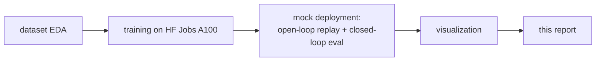
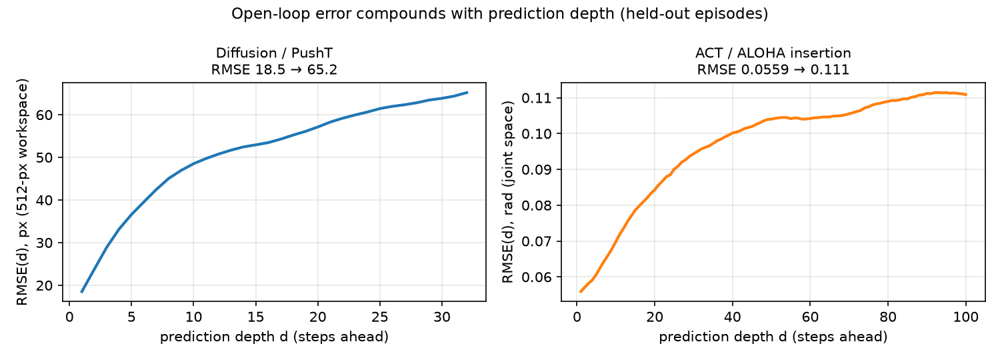
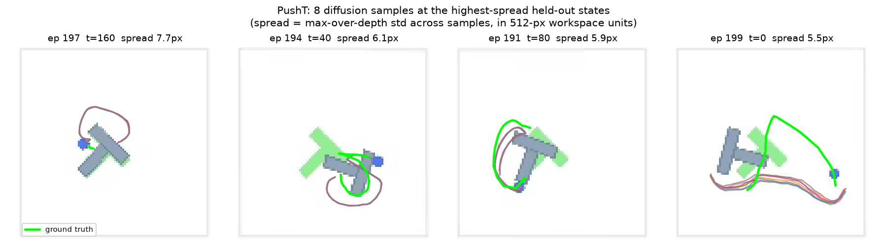
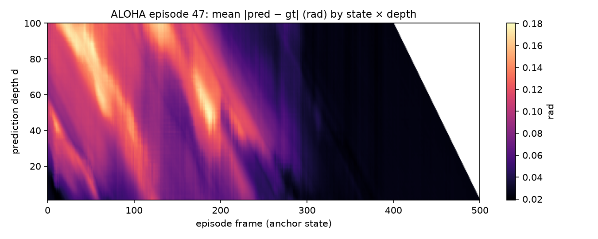
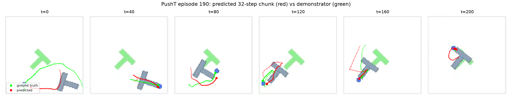
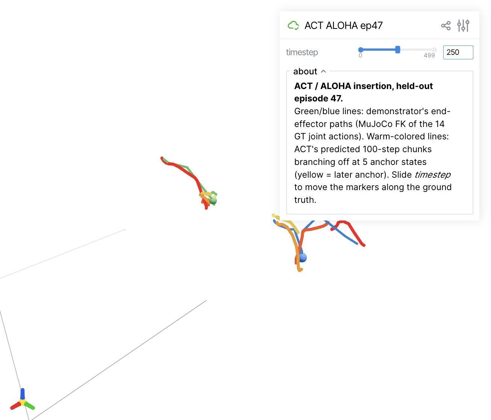

# Behavior Cloning with LeRobot: ACT and Diffusion Policy, Trained, Deployed, and Dissected

*Final report. All numbers trace to files in this repo (`outputs/`, `reports/`); the
per-stage design notes linked throughout contain the full decision logs.*

---

## 1. Task and approach

The task: train two behavior-cloning policies with [LeRobot](https://github.com/huggingface/lerobot),
run a **mock deployment** on data and environments they never saw during training, and
visualize how their predictions compare to ground truth. We built it as a five-stage
pipeline, each stage designed in writing before it was built, and each leaving a live
issues log (the task explicitly asks what LeRobot problems we hit — §7):



Design doc: [DESIGN.md](../DESIGN.md). Stage notes: [pipeline](../NOTES_PIPELINE.md),
[training](../training/NOTES_TRAINING.md), [deployment](../NOTES_DEPLOYMENT.md),
[visualization](../NOTES_VISUALIZATION.md), [writeup](../NOTES_WRITEUP.md).

## 2. Policies and data

Naive behavior cloning (a network regressing one action per observation) fails for two
well-documented reasons: single-step errors **compound** during rollout (covariate
shift, [DAgger](https://arxiv.org/abs/1011.0686)), and human demonstrations are
**multimodal** — averaging two valid strategies produces an invalid one. The two
policies we trained are the field's main answers:

- **[ACT](https://arxiv.org/abs/2304.13705)** (Action Chunking with Transformers,
  51.6 M params here): a CVAE + transformer that predicts a **chunk of 100 future
  actions** at once, attacking compounding error. Trained on
  [`lerobot/aloha_sim_insertion_human`](https://huggingface.co/datasets/lerobot/aloha_sim_insertion_human)
  — bimanual peg-in-socket insertion, 50 human-teleoperated episodes at 50 fps, 14-dim
  joint actions. Split: episodes 0–44 train, **45–49 held out**.
- **[Diffusion Policy](https://arxiv.org/abs/2303.04137)** (262.7 M params here):
  models the action distribution with conditional denoising diffusion, attacking
  multimodality. Trained on [`lerobot/pusht`](https://huggingface.co/datasets/lerobot/pusht)
  — push a T-block onto a target with a cylindrical end-effector, 206 episodes at
  10 fps, 2-D end-effector-target actions. Split: episodes 0–184 train, **185–205
  held out**.

The held-out episodes power the open-loop study (§4a); the matching simulators
(`gym-pusht`, `gym-aloha`/MuJoCo) power the closed-loop study (§4b).

## 3. Training

Both policies trained on Hugging Face Jobs `a100-large` with LeRobot 0.6.0 defaults
matched to the published reference configs (full rationale:
[training notes](../training/NOTES_TRAINING.md)):

| | Diffusion / PushT | ACT / ALOHA |
|---|---|---|
| steps / batch | 200K / 64 (seed 100000, matches official card) | 100K / 8 |
| wall time | 6 h 35 m (~9.3 step/s) | 1 h 18 m (~21 step/s) |
| loss | 0.303 → 0.001 | L1 0.40 → 0.042 (KL → ~0.000) |
| artifacts | final + 8 checkpoints (every 25K) on the [Hub](https://huggingface.co/nilakarthikesan/diffusion_pusht) | final + 5 checkpoints (every 20K) on the [Hub](https://huggingface.co/nilakarthikesan/act_aloha_insertion) |

Two training-stage observations that matter later: ACT's **KL term collapsed to ~0**
(the CVAE latent is ignored → ACT is effectively deterministic at inference), and
in-training simulator evaluation had to be **disabled** because the official
`lerobot-gpu` image lacks the gym environments (issue log, §7c) — which forced
checkpoint selection into the deployment stage and set up finding #1.

## 4. Mock deployment

Two deliberately separate questions
([deployment notes](../NOTES_DEPLOYMENT.md)):

**(a) Open-loop:** at every state of every held-out episode, the policy predicts its
full action chunk from the demonstrator's observations; we compare against what the
human actually did, masking episode-end padding
([`scripts/03_mock_deploy.py`](../scripts/03_mock_deploy.py)).

**(b) Closed-loop:** the policy drives the simulator (`lerobot-eval`), in two phases:
a cheap **screen** of every banked checkpoint (10 episodes each, fixed seed), then a
50-episode **confirm** on the winner.

Results:

| | open-loop (held-out) | closed-loop (50-episode confirm) | deployed checkpoint |
|---|---|---|---|
| Diffusion / PushT | RMSE 51.9 px overall (694 states); 18.5 px at depth 1 → 65.2 px at depth 32 | **48 % success** (avg max reward 0.84) | **200K — the final one** |
| ACT / ALOHA | RMSE 0.097 rad overall (2,500 states); 0.056 → 0.111 rad over 100 steps | **20 % success** (avg max reward 2.26) | **20K — the earliest one** |

## 5. Findings

### 5.1 Checkpoint selection by rollout is not optional

The checkpoint screens (success % over 10 fixed-seed episodes per banked checkpoint):

| ACT ckpt | 20K | 40K | 60K | 80K | 100K |
|---|---|---|---|---|---|
| success | **20 %** | 10 % | 10 % | 10 % | **0 %** |

| Diffusion ckpt | 25K | 50K | 75K | 100K | 125K | 150K | 175K | 200K |
|---|---|---|---|---|---|---|---|---|
| success | 20 % | 0 % | 30 % | 20 % | 40 % | 20 % | 30 % | **50 %** |

Same pipeline, **opposite outcomes**: ACT's best checkpoint is its *earliest* and its
final checkpoint is unusable, while diffusion keeps improving to the end. Without
rolling out every checkpoint ([robomimic](https://arxiv.org/abs/2108.03298)'s thesis),
we would have shipped a 0 %-success ACT.

### 5.2 Open-loop fidelity ≠ closed-loop competence

ACT's open-loop imitation kept improving with training while its rollout success
collapsed (5.1). Prediction error also compounds smoothly with depth for both
policies — yet the depth curves alone say nothing about which checkpoint survives
deployment. This is the covariate-shift gap the literature warns about
([DAgger](https://arxiv.org/abs/1011.0686), [arXiv:2604.02523](https://arxiv.org/abs/2604.02523)),
reproduced end-to-end on our own runs.



### 5.3 The trained diffusion policy is nearly deterministic

The motivating story for diffusion is multimodality, so we sampled the policy 8 times
(fresh noise) at probe states across all 21 held-out episodes. The samples **collapse
to a tight bundle**: median across-sample spread 1.6 px, maximum 7.7 px, in a 512-px
workspace — with the largest spreads at episode-start approach states, exactly where
ambiguity should live. [Independent experiments by Alexander Soare](https://github.com/alexander-soare/little_experiments/blob/main/action_multimodality.md)
reach the same conclusion at K≈100. The policy earns its 48 % by being decisive, not
by hedging:



### 5.4 Events, not states, are what's hard to predict

ACT's open-loop error, laid out by anchor state × prediction depth, shows **diagonal**
streaks — lines of constant *event time*. The grasp/contact moments (frames ~50–250)
are hard to predict from *any* earlier state, while the post-transfer hold phase is
near-zero error. That is the open-loop echo of why closed-loop insertions fail at the
grasp, never on the approach:



## 6. Visualizations

All figures come from saved deployment arrays — no re-inference
([visualization notes](../NOTES_VISUALIZATION.md), coordinate mapping verified
frame-by-frame against the pusher's motion):



- Animated overlay of a full held-out episode: [`m5/pusht_ep190.mp4`](m5/pusht_ep190.mp4)
- **Interactive 3D scene** (MuJoCo forward kinematics → Viser): demonstrator
  end-effector traces with ACT's predicted chunks branching off, timestep slider —
  run `python scripts/05_viser_aloha.py` and open the printed link.



## 7. LeRobot issues encountered (curated; full forensics in the stage notes)

**(a) Version skew and packaging.** The official `lerobot-gpu:latest` training image
is built from unreleased git main, so cloud-trained checkpoints contained a config
field (`gradient_checkpointing`) that **no released LeRobot can parse** — draccus
fails hard on unknown fields. We stripped the field from all 9 configs on the Hub to
make our own models loadable. Related: `DiffusionPolicy` needs the `diffusion` extra
that nothing surfaced until local inference; `matplotlib` ≥3.9 API removals.

**(b) Silent-failure traps.** Normalization lives in *separate* processor artifacts —
feeding raw observations to a policy produces garbage with no error. With an episode
subset, `LeRobotDataset.meta.episodes` still returns the full table with global
indices (walks off the end of the subset). ACT rejects the obs-window format diffusion
requires, discovered only at forward-pass time. And Python's stdout buffering made a
healthy 40-minute compute job indistinguishable from a hang — we killed it before
diagnosing; `python -u` became policy.

**(c) Resource ceilings.** The HF Jobs image lacks `gym_pusht`/`gym_aloha`, so
in-training eval crashes — we disabled it and moved checkpoint selection into
deployment (which produced finding 5.1). Locally, batch 64 × DDPM-100 on the 262.7 M
UNet exceeded Apple-silicon unified memory and thrashed instead of computing; batch 16
is the validated ceiling.

**(d) Evaluation gotchas.** The saved preprocessor pipeline hard-codes the training
device (`cuda`) and fails on any other machine unless overridden. The ACT smoke test
scored 0.0 reward and looked broken — the screen revealed it had simply used the worst
checkpoint. The current `hf download` CLI prints `path=<dir>` instead of the bare
path, which silently corrupts scripted `--policy.path` arguments.

Issue IDs D1–D12 and V-A–V-E in [NOTES_DEPLOYMENT.md](../NOTES_DEPLOYMENT.md) §5 and
[NOTES_VISUALIZATION.md](../NOTES_VISUALIZATION.md) §6.

## 8. Limitations and next steps

- **48 % vs the official card's ~65 %** (diffusion, PushT): attributable to training
  on 185 of 206 episodes (21 held out for the replay study), a different seed, and
  ±~14 % binomial noise at n=50. Stated, not excused.
- **ACT at 20 %** is in the ballpark of the original ACT paper's human-demo insertion
  results; closing the gap would start from earlier/denser checkpoints (10K–30K) and
  contact-phase analysis rather than more training — more training made it worse.
- **Researched backlog** ([visualization notes §7](../NOTES_VISUALIZATION.md)):
  K≈100 Monte-Carlo fans, an observation-noise probe that provably re-elicits
  multimodality, and a [Rerun](https://github.com/rerun-io/rerun)-based synced
  video + prediction inspector.

## Reproduce

```bash
pip install -r requirements.txt
./scripts/02_train.sh hfjobs-diffusion     # or hfjobs-act; needs `hf auth login`
python scripts/03_mock_deploy.py --policy diffusion_pusht   # open-loop replay
./scripts/03b_screen_checkpoints.sh act 10                  # checkpoint screen
python scripts/04_visualize.py all                          # all figures
python scripts/05_viser_aloha.py                            # interactive 3D scene
```
